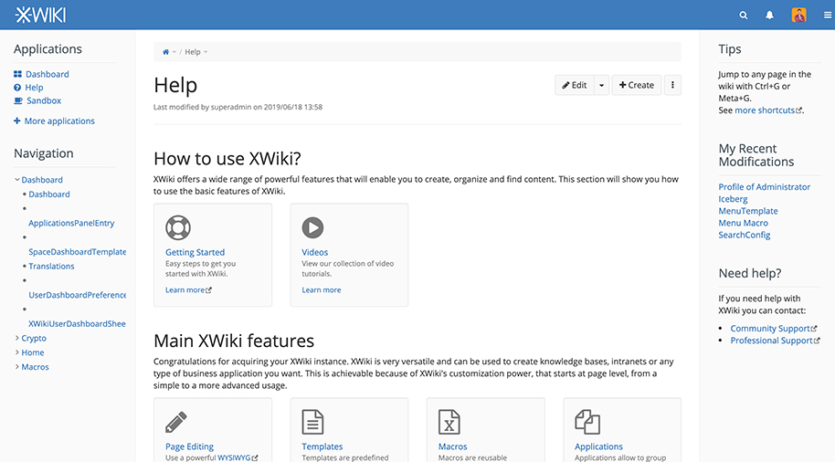

<!--
NB: Deze README is automatisch gegenereerd door <https://github.com/YunoHost/apps/tree/master/tools/readme_generator>
Hij mag NIET handmatig aangepast worden.
-->

# XWiki voor Yunohost

[](https://ci-apps.yunohost.org/ci/apps/xwiki/)  

[](https://install-app.yunohost.org/?app=xwiki)

*[Deze README in een andere taal lezen.](./ALL_README.md)*

> *Met dit pakket kun je XWiki snel en eenvoudig op een YunoHost-server installeren.*  
> *Als je nog geen YunoHost hebt, lees dan [de installatiehandleiding](https://yunohost.org/install), om te zien hoe je 'm installeert.*

## Overzicht

XWiki is an Open Source wiki engine (LGPLv2) suitable for use by workgroups (associations, companies, etc.). The software allows the rapid creation of small applications to meet different information management needs.

**Geleverde versie:** 16.8.0~ynh1

**Demo:** <https://playground.xwiki.org/xwiki/bin/view/Main/WebHome>

## Schermafdrukken



## Documentatie en bronnen

- Officiele website van de app: <https://www.xwiki.org/>
- Officiele gebruikersdocumentatie: <https://www.xwiki.org/xwiki/bin/view/Documentation/UserGuide/>
- Officiele beheerdersdocumentatie: <https://www.xwiki.org/xwiki/bin/view/Documentation/AdminGuide/>
- Upstream app codedepot: <https://github.com/xwiki/xwiki-platform>
- YunoHost-store: <https://apps.yunohost.org/app/xwiki>
- Meld een bug: <https://github.com/YunoHost-Apps/xwiki_ynh/issues>

## Ontwikkelaarsinformatie

Stuur je pull request alsjeblieft naar de [`testing`-branch](https://github.com/YunoHost-Apps/xwiki_ynh/tree/testing).

Om de `testing`-branch uit te proberen, ga als volgt te werk:

```bash
sudo yunohost app install https://github.com/YunoHost-Apps/xwiki_ynh/tree/testing --debug
of
sudo yunohost app upgrade xwiki -u https://github.com/YunoHost-Apps/xwiki_ynh/tree/testing --debug
```

**Verdere informatie over app-packaging:** <https://yunohost.org/packaging_apps>
