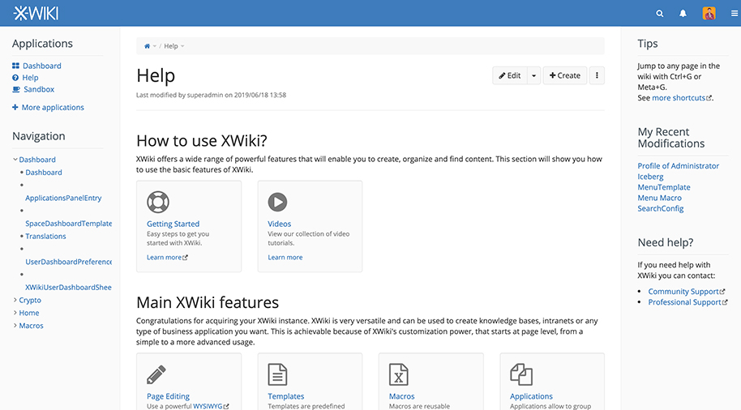

<!--
To README zostało automatycznie wygenerowane przez <https://github.com/YunoHost/apps/tree/master/tools/readme_generator>
Nie powinno być ono edytowane ręcznie.
-->

# XWiki dla YunoHost

[](https://ci-apps.yunohost.org/ci/apps/xwiki/)


[](https://install-app.yunohost.org/?app=xwiki)

*[Przeczytaj plik README w innym języku.](./ALL_README.md)*

> *Ta aplikacja pozwala na szybką i prostą instalację XWiki na serwerze YunoHost.*  
> *Jeżeli nie masz YunoHost zapoznaj się z [poradnikiem](https://yunohost.org/install) instalacji.*

## Przegląd

XWiki is an Open Source wiki engine (LGPLv2) suitable for use by workgroups (associations, companies, etc.). The software allows the rapid creation of small applications to meet different information management needs.

**Dostarczona wersja:** 17.1.0~ynh1

**Demo:** <https://playground.xwiki.org/xwiki/bin/view/Main/WebHome>

## Zrzuty ekranu



## Dokumentacja i zasoby

- Oficjalna strona aplikacji: <https://www.xwiki.org/>
- Oficjalna dokumentacja: <https://www.xwiki.org/xwiki/bin/view/Documentation/UserGuide/>
- Oficjalna dokumentacja dla administratora: <https://www.xwiki.org/xwiki/bin/view/Documentation/AdminGuide/>
- Repozytorium z kodem źródłowym: <https://github.com/xwiki/xwiki-platform>
- Sklep YunoHost: <https://apps.yunohost.org/app/xwiki>
- Zgłaszanie błędów: <https://github.com/YunoHost-Apps/xwiki_ynh/issues>

## Informacje od twórców

Wyślij swój pull request do [gałęzi `testing`](https://github.com/YunoHost-Apps/xwiki_ynh/tree/testing).

Aby wypróbować gałąź `testing` postępuj zgodnie z instrukcjami:

```bash
sudo yunohost app install https://github.com/YunoHost-Apps/xwiki_ynh/tree/testing --debug
lub
sudo yunohost app upgrade xwiki -u https://github.com/YunoHost-Apps/xwiki_ynh/tree/testing --debug
```

**Więcej informacji o tworzeniu paczek aplikacji:** <https://yunohost.org/packaging_apps>
